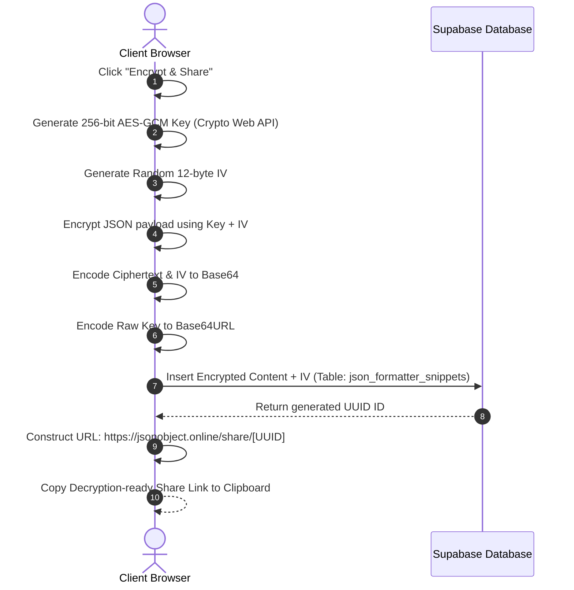

# JSONObject.OnLine — Secure JSON Formatter & Developer Sandbox

JSONObject.OnLine is a high-performance, developer-focused, client-side JSON formatting and transformation utility platform. It features deep formatting, syntax repair, and bidirectional format compilation alongside client-side cryptographic snippet sharing, a premium diagnostics warning system, and developer sandboxes.

```
┌──────────────────────────────────────────────────────────────────────┐
│                          JSONObject.OnLine                           │
│     "Nothing is being saved anywhere except your browser."           │
├──────────────────────────────────┬───────────────────────────────────┤
│            Left Pane             │            Right Pane             │
│        (Input Workspace)         │       (Transformation Tabs)       │
│                                  │                                   │
│  ┌────────────────────────────┐  │  ┌─────────────────────────────┐  │
│  │ Monaco Editor (Raw Input)  │  │  │ Formatted, YAML, XML, CSV   │  │
│  └────────────────────────────┘  │  │ Types, Schema, Sandbox      │  │
│                                  │  └─────────────────────────────┘  │
│                                  │  [Fullscreen Output Option FAB]   │
└──────────────────────────────────┴───────────────────────────────────┘
```

---

## 1. Key Tech Stack & Architecture

*   **Core framework**: Next.js 16 (App Router) using React 19.
*   **Styling (CSS)**: Tailwind CSS v4 (Zero-runtime CSS variables utility architecture).
*   **State Management**: Zustand v5 (Reactive, decoupled client store).
*   **Editor Core**: Monaco Editor & Diff Editor (Asynchronous web workers tokenization).
*   **Testing Suite**: Vitest v4 (Fast in-memory unit tests runner).
*   **Database / Backend**: Supabase integration with custom API fallback routing.

---

## 2. Core Workflows & Mechanics

### 2.1 Client-Side Encryption Flow
Snippet sharing guarantees absolute security using client-side **AES-GCM-256** encryption. The private key is appended as a URL hash fragment (`#key=...`), which is never sent to the hosting server or stored in the database.



### 2.2 Developer Diagnostics Toast System
Built to handle massive payloads safely, the store automatically measures paste sizes and triggers rich, architect-themed toasts:
*   **Memory Mode (1.5 MB – 5 MB)**: Bypasses `localStorage` completely to prevent main thread blocking, warning the user that data won't persist on refresh.
*   **High Load (5 MB – 10 MB)**: Warns of elevated Monaco worker thread and syntax highlighting latency.
*   **Heavy Load (10 MB – 50 MB)**: Warns of V8 engine heap limits and garbage collection stuttering.
*   **Crash Risk (> 50 MB)**: Error alert warning of a high risk of browser tab crashes.
*   *Note*: The system tracks size classes, preventing warning spam during active typing.

### 2.3 Asynchronous Font-Loading Alignment
Monaco Editor calculates line dimensions based on initially available system fallback fonts. To support modern coding fonts like **JetBrains Mono** and **Cascadia Code**, the application listens to browser `FontFaceSet` loads (`document.fonts.ready`), forcing Monaco to run `editor.layout()` to recalculate character sizes and line heights once the web fonts finish downloading.

---

## 3. Platform Features & Transformation Engines

### 3.1 Monaco Editor & Diff View
*   **Theme**: Customized `"zen-dark"` color system matching dark modes.
*   **Line Spacing**: Set to a highly dense `1.02` multiplier for compact viewing of large datasets.
*   **Suppress Console Noise**: Automatically intercepts and suppresses harmless Monaco cancellation errors in the browser.
*   **Monaco Diff Visualizer**: Original-to-modified side-by-side split comparison view.

### 3.2 Bidirectional Format Converters
*   **YAML**: Bidirectional serialization of parsed JSON structures into YAML using the `yaml` library.
*   **XML**: Formats nested JSON objects or arrays (wrapped in parent `<item>` nodes) into XML using `fast-xml-parser`.
*   **CSV**: Translates JSON arrays and objects into flat tabular formats using `json-2-csv`.

### 3.3 Dynamic Type Definition Compiler
Translates arbitrary JSON structures dynamically into target type systems:
1.  **TypeScript**: Outputs nested interfaces, wrapping single-item array models cleanly (e.g. `tags: string[];` instead of union-wrapped `tags: (string)[];`).
2.  **Go**: Generates structural schemas with idiomatic capitalized struct names and corresponding ``json:"key"`` struct tags.
3.  **Rust**: Builds structs decorated with `#[derive(Serialize, Deserialize)]`. Converts non-snake-case tags (e.g., hyphenated properties like `some-key`) using `#[serde(rename = "some-key")]` annotations and escapes Rust keywords (e.g., `r#type`).
4.  **Python**: Generates Pydantic classes inheriting `BaseModel`, sanitizing reserved keywords (e.g., `class` becomes `class_`).
5.  **Java**: Builds static nested classes inside a parent `Wrapper` container, complete with private fields, `@JsonProperty` annotations, and corresponding getters/setters.

### 3.4 Sandbox Environments
*   **JSON Schema Sandbox**: Evaluates JSON payloads against schemas using `Ajv` schema compiler and reports path-specific errors in real-time.
*   **JSONPath Query Sandbox**: Evaluates selectors using JSONPath syntax.
*   **JWT / Base64 Decoder**: Decodes JWT headers and payloads, with styled outputs and a button to load decoded payloads directly back into the workspace.

---

## 4. Repository File Structure

```
├── app/
│   ├── api/
│   │   └── mock-share/
│   │       └── route.ts           # Server-side offline mock DB persistence
│   ├── faq/
│   │   └── page.tsx               # Beautiful FAQ page explaining caching & encryption
│   ├── privacy/
│   │   └── page.tsx               # Beautiful Privacy Policy page detailing local storage & cookies
│   ├── favicon.ico
│   ├── globals.css                # Layout theme, font styling, and custom animations
│   ├── icon.png                   # SEO favicon
│   ├── layout.tsx                 # Site layout metadata & global fonts config
│   ├── page.tsx                   # Main dashboard, resizable split grid & layouts
│   ├── robots.ts                  # Dynamic robots.txt metadata router
│   ├── sitemap.ts                 # Dynamic sitemap.xml metadata router
│   └── share/
│       └── [id]/
│           └── page.tsx           # Dynamic client decryption share router
├── components/
│   ├── JSONEditor.tsx             # Monaco Editor wrapper and configuration
│   ├── JSONTreeView.tsx           # Collapsible JSON Tree node
│   └── ToastContainer.tsx         # Premium developer diagnostics toasts
├── store/
│   ├── store.ts                   # Zustand state store
│   └── store.test.ts              # Vitest test suite for store, storage & toasts
├── utils/
│   ├── jsonUtils.ts               # Cryptography wrappers & parsing metrics calculations
│   ├── jsonUtils.test.ts          # Core metrics, converters, and cryptographic Vitest test suite
│   ├── schemaGenerator.ts         # Draft-07 JSON Schema generator
│   ├── schemaGenerator.test.ts    # Schema compiler test assertions
│   ├── supabaseClient.ts          # Supabase SDK interface & offline fallback mock
│   ├── typeGenerator.ts           # TS, Go, Rust, Python, Java code model compiler
│   └── typeGenerator.test.ts      # Code model compilation test assertions
├── schema.sql                     # Database schema setup for json_formatter_snippets
└── package.json                   # Vitest scripts and dependencies declaration
```

---

## 5. Setup and Verification

### 5.1 Clone & Install Dependencies
```bash
pnpm install
```

### 5.2 Database Schema Setup
Log in to your Supabase Dashboard, open the **SQL Editor**, and run the commands in [schema.sql](file:///c:/Users/mushfiq/Documents/Projects/JSON_Formatter/schema.sql) to set up the RLS-secure schema:
```sql
CREATE TABLE IF NOT EXISTS public.json_formatter_snippets (
    id UUID PRIMARY KEY DEFAULT gen_random_uuid(),
    encrypted_content TEXT NOT NULL,
    iv TEXT NOT NULL,
    language TEXT NOT NULL DEFAULT 'json',
    created_at TIMESTAMPTZ NOT NULL DEFAULT now(),
    expires_at TIMESTAMPTZ
);
```

### 5.3 Configuration
Create a `.env` file in the root folder:
```env
NEXT_PUBLIC_SUPABASE_URL=https://your-project-id.supabase.co
NEXT_PUBLIC_SUPABASE_ANON_KEY=your-anon-public-key
```

### 5.4 Run Development Server
```bash
pnpm dev
```
Open `http://localhost:3000` to access the local environment.

### 5.5 Run Tests
Executes all 43 unit test assertions:
```bash
pnpm test
```
Outputs coverage verification results for formatting, schema models, type generators, token decoders, alerts, and cryptography.
