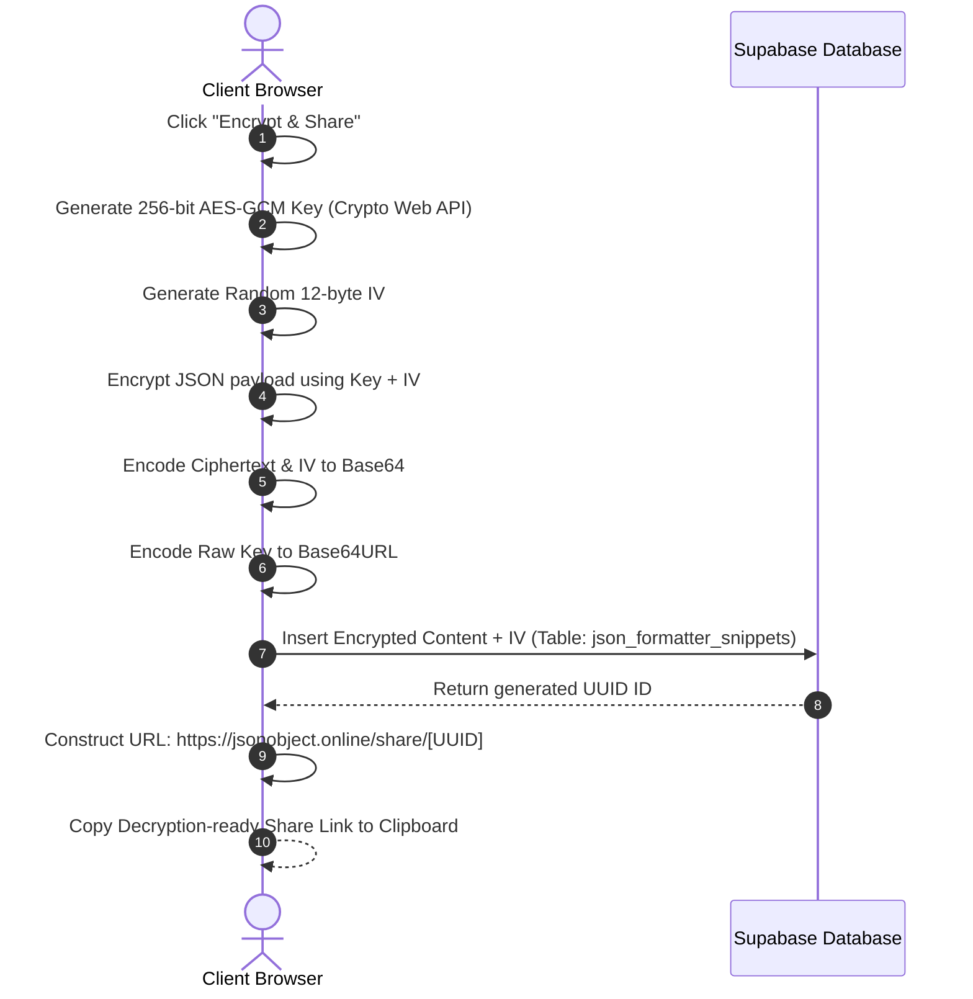

# JSONObject.OnLine — Secure Zero-Knowledge JSON Formatter & Developer Sandbox

JSONObject.OnLine is a high-performance, developer-focused, client-side zero-knowledge JSON formatting and transformation utility platform. It features deep formatting, syntax repair, and bidirectional format compilation alongside client-side cryptographic snippet sharing.

```
┌──────────────────────────────────────────────────────────────────────┐
│                          JSONObject.OnLine                           │
├──────────────────────────────────┬───────────────────────────────────┤
│            Left Pane             │            Right Pane             │
│        (Input Workspace)         │       (Transformation Tabs)       │
│                                  │                                   │
│  ┌────────────────────────────┐  │  ┌─────────────────────────────┐  │
│  │ Monaco Editor (Raw Input)  │  │  │ Formatted, YAML, XML, CSV   │  │
│  └────────────────────────────┘  │  │ Types, Schema, Sandbox      │  │
│                                  │  └─────────────────────────────┘  │
│                                  │  [Fullscreen Output Option FAB]   │
└──────────────────────────────────┴───────────────────────────────────┘
```

---

## 1. Architectural Workflows

### 1.1 Zero-Knowledge Encryption Flow
The snippet sharing feature guarantees absolute zero-knowledge security using client-side **AES-GCM-256** encryption. The private key is appended as a URL hash fragment (`#key=...`), which is never sent to the hosting server or stored in the database.



---

## 2. Platform Core Architecture & Features

### 2.1 Workspace Resizable Split Layout
*   **Desktop Layout**: Renders side-by-side panes separated by a tactile drag handler.
*   **Mouse Drag Event Handler**:
    *   Tracks horizontal drag movements on desktop viewport widths.
    *   Implements safety constraints restricting left pane width between **15%** and **85%** to prevent panels from collapsing or sliding off-screen.
    *   Injects pointer-event resets to prevent text selection and Monaco focus bugs while active resizing is in progress.

### 2.2 Monaco Editor Setup & Paste Interception
*   **Custom Dark Theme**: Extends Monaco's editor options with a customized `"zen-dark"` color system.
*   **Interactive Cursor Tracking**: Captures Monaco's cursor state changes (`onSelectionDidChange`) and displays the active line and column (`Ln X, Col Y`) dynamically in the status bar.
*   **Smart Paste Hook (`onDidPaste`)**:
    *   Listens to paste events on the raw input editor.
    *   Automatically runs `jsonrepair` and formatting on the pasted text to recover malformed JSON immediately.
    *   Resets the editor's scrollbars and relocates the cursor to the top-left (line 1, column 1) to ensure the view does not scroll to the right or bottom of the pasted block.
    *   Uses Monaco's `executeEdits` API to preserve the editor's undo/redo history, letting the user revert the auto-format with a single `Ctrl + Z`.

### 2.3 Zustand State Management Store
Maintains a reactive, unified state model in `store/store.ts` for all core features:
*   `rawInput`: Source JSON string.
*   `formattedOutput` & `minifiedOutput`: Formatted and minified strings.
*   `xmlOutput` & `csvOutput`: Converted outputs.
*   `metrics`: JSON structural metrics (calculated size in bytes, total keys, array structures, AST nodes, and maximum nesting depth).
*   `viewMode`: Toggles between transformations (Formatted, Tree, YAML, XML, CSV, Types, Schema, Query, Diff, Escaped, and JWT).

### 2.4 Transparent Supabase Mock Storage Fallback
To enable frictionless developer environments and offline usage, `utils/supabaseClient.ts` operates as a transparent wrapper:
*   **Real Connection**: Uses `@supabase/supabase-js` to connect to Supabase if environment tokens are present.
*   **Mock Storage**: If environment keys are missing, queries are routed to a mock interface:
    *   Saves snippets locally in browser `localStorage`.
    *   Mirrors snippets on the local server in `tmp/mock_snippets.json` (via `/api/mock-share` POST/GET API endpoints) to allow sharing links to work across multiple browser profiles, incognito tabs, and headless testing pipelines.

---

## 3. Supported Transformation Engines

### 3.1 Bidirectional Format Converters
*   **YAML**: Bidirectional serialization of parsed JSON structures into YAML using the `yaml` library.
*   **XML**: Formats nested JSON objects or arrays (wrapped in parent `<item>` nodes) into XML using `fast-xml-parser`.
*   **CSV**: Translates JSON arrays and objects into flat tabular formats using `json-2-csv`.

### 3.2 Dynamic Type Definition Compiler
Translates arbitrary JSON structures dynamically into target type systems:
1.  **TypeScript**: Outputs nested interfaces, wrapping single-item array models cleanly (e.g. `tags: string[];` instead of union-wrapped `tags: (string)[];`).
2.  **Go**: Generates structural schemas with idiomatic capitalized struct names and corresponding ``json:"key"`` struct tags.
3.  **Rust**: Builds structs decorated with `#[derive(Serialize, Deserialize)]`. Converts non-snake-case tags (e.g., hyphenated properties like `some-key`) using `#[serde(rename = "some-key")]` annotations and escapes Rust keywords (e.g., `r#type`).
4.  **Python**: Generates Pydantic classes inheriting `BaseModel`, sanitizing reserved keywords (e.g., `class` becomes `class_`).
5.  **Java**: Builds static nested classes inside a parent `Wrapper` container, complete with private fields, `@JsonProperty` annotations, and corresponding getters/setters.

### 3.3 Sandbox Environments
*   **JSON Schema Sandbox**: Evaluates JSON payloads against schemas using `Ajv` schema compiler and reports path-specific errors in real-time.
*   **JSONPath Query Sandbox**: Evaluates selectors using JSONPath syntax.
*   **Monaco Diff Visualizer**: Side-by-side original-to-comparison visual highlight editor.
*   **JWT / Base64 Decoder**: Decodes JWT headers and payloads, with styled outputs and a button to load decoded payloads directly back into the workspace.

---

## 4. Specific Right Pane Fullscreen View
*   Features a floating action button inside the Right Pane at `absolute bottom-4 right-4 z-30` that triggers fullscreen mode for **only** the Right Pane (Output Viewer / Transformation Tab Area).
*   Uses `ref={rightPaneRef}` to call `.requestFullscreen()` specifically on the right container.
*   Dynamically fits layout sizes based on state (`w-full h-full p-6` when fullscreen vs `h-[calc(100vh-210px)]` in split view) so that the output editors fill the screen.

---

## 5. Repository File Structure

```
├── app/
│   ├── api/
│   │   └── mock-share/
│   │       └── route.ts           # Server-side offline mock DB persistence
│   ├── favicon.ico
│   ├── globals.css                # Layout theme, custom scrollbars & premium footer animations
│   ├── icon.png                   # SEO favicon
│   ├── layout.tsx                 # Site layout metadata & global fonts config
│   ├── page.tsx                   # Main dashboard, resizable grid layout & fullscreen FAB
│   ├── robots.ts                  # Dynamic robots.txt metadata router
│   ├── sitemap.ts                 # Dynamic sitemap.xml metadata router
│   └── share/
│       └── [id]/
│           └── page.tsx           # Dynamic client decryption share router
├── components/
│   ├── JSONEditor.tsx             # Monaco Editor wrapper and configuration
│   └── JSONTreeView.tsx           # Lazy-rendering collapsible JSON Tree node
├── store/
│   └── store.ts                   # Zustand state store
├── utils/
│   ├── jsonUtils.ts               # Cryptography wrappers & parsing metrics calculations
│   ├── jsonUtils.test.ts          # Core metrics, converters, and cryptographic Vitest test suite
│   ├── schemaGenerator.ts         # Draft-07 JSON Schema recursive generator
│   ├── schemaGenerator.test.ts    # Schema compiler test assertions
│   ├── supabaseClient.ts          # Supabase SDK interface & offline fallback mock
│   ├── typeGenerator.ts           # TS, Go, Rust, Python, Java code model compiler
│   └── typeGenerator.test.ts      # Code model compilation test assertions
├── schema.sql                     # Database schema setup for json_formatter_snippets
└── package.json                   # Vitest scripts and dependencies declaration
```

---

## 6. Setup and Verification

### 6.1 Clone & Install Dependencies
```bash
pnpm install
```

### 6.2 Database Schema Setup
Log in to your Supabase Dashboard, open the **SQL Editor**, and run the commands in [schema.sql](file:///c:/Users/mushfiq/Documents/Projects/JSON_Formatter/schema.sql) to set up the RLS-secure schema:
```sql
CREATE TABLE IF NOT EXISTS public.json_formatter_snippets (
    id UUID PRIMARY KEY DEFAULT gen_random_uuid(),
    encrypted_content TEXT NOT NULL,
    iv TEXT NOT NULL,
    language TEXT NOT NULL DEFAULT 'json',
    created_at TIMESTAMPTZ NOT NULL DEFAULT now(),
    expires_at TIMESTAMPTZ
);
```

### 6.3 Configuration
Create a `.env` file in the root folder:
```env
NEXT_PUBLIC_SUPABASE_URL=https://xsomajhjyzywscovvbho.supabase.co
NEXT_PUBLIC_SUPABASE_ANON_KEY=your-anon-public-key
```

### 6.4 Run Development Server
```bash
pnpm dev
```
Open `http://localhost:3000` to access the local environment.

### 6.5 Run Tests
Executes all 29 unit test assertions:
```bash
pnpm test
```
Outputs coverage verification results for formatting, schema models, type generators, token decoders, and cryptography.
